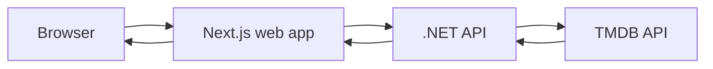
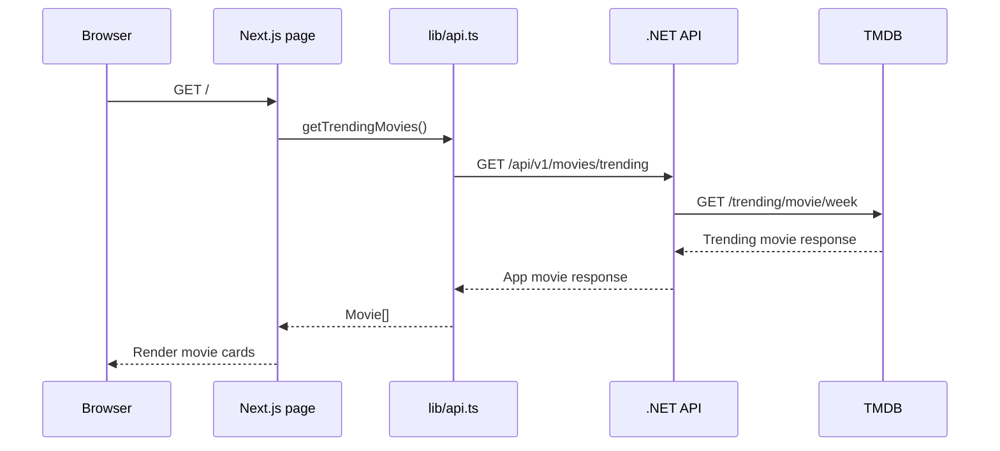
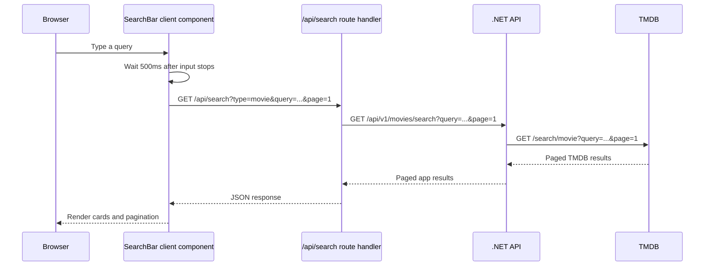

# Movie Search Project Flow

This project is a Next.js frontend backed by a .NET API. The .NET API calls TMDB and keeps the TMDB access token on the server side.

## High-level architecture



The browser never calls TMDB directly. It calls either the Next.js app or the .NET API, depending on the feature.

## Main routes

| Frontend route | Purpose                         | Rendering                                |
| -------------- | ------------------------------- | ---------------------------------------- |
| `/`            | Movie trending and movie search | Server page with client search component |
| `/?type=tv`    | TV trending and TV search       | Server page with client search component |
| `/movies/[id]` | Movie details and trailer       | Server-rendered dynamic page             |
| `/tv/[id]`     | TV show details                 | Server-rendered dynamic page             |
| `/api/search`  | Browser-facing search proxy     | Next.js route handler                    |

Movies are the default because the home page treats every `type` value other than `tv` as `movie`.

## API client

The shared API client is in `lib/api.ts`.

### Base URL

```ts
const API_BASE_URL = process.env.NEXT_PUBLIC_API_BASE_URL;
```

The value normally points to the local .NET API, for example:

```text
http://localhost:5080/api/v1
```

All requests go through the generic `apiFetch<T>()` helper. It:

1. Combines the base URL with an endpoint path.
2. Adds the `Accept: application/json` header.
3. Calls `fetch` with the supplied options.
4. Converts non-2xx responses into `ApiError`.
5. Parses the response as JSON.

Example:

```ts
export function getTrendingMovies(): Promise<Movie[]> {
  return apiFetch<Movie[] | MovieSearchResponse>("/movies/trending", {
    cache: "no-store",
  }).then((response) =>
    Array.isArray(response) ? response : response.results,
  );
}
```

`cache: "no-store"` is used because the app should show fresh TMDB-backed data for each request.

## Movie and TV request flows

### Trending movies



The home page is an async Server Component. It loads trending data before returning HTML, so the initial movie grid is rendered on the server.

### Trending TV

Selecting the TV tab navigates to `/?type=tv`.

The server page detects the query parameter and calls:

```text
GET /api/v1/tv/trending
```

The TV API uses fields such as `name` and `firstAirDate`. `lib/api.ts` maps those fields into the shared frontend movie-card shape:

```ts
function toMovie(show: TvShowResponse): Movie {
  return {
    id: show.id,
    title: show.name,
    overview: show.overview,
    posterPath: show.posterPath,
    backdropPath: show.backdropPath,
    voteAverage: show.voteAverage,
    releaseDate: show.firstAirDate,
  };
}
```

This lets Movies and TV reuse `MovieCard` and `TrendingGrid` without duplicating the visual components.

## Search flow

`SearchBar` is a Client Component because it owns interactive browser state:

- Search input value
- Debouncing
- Loading state
- Error state
- Abort controllers
- Pagination state
- Scrolling to the results section

### Browser to Next.js search proxy



For TV, the same flow uses `type=tv`:

```text
GET /api/search?type=tv&query=...&page=1
```

The Next.js route handler selects the upstream client function:

```ts
await (mediaType === "tv"
  ? searchTvShows(query, page)
  : searchMovies(query, page));
```

The route handler is useful here because it gives the browser one stable frontend endpoint while keeping the media-specific API selection on the server.

### Search debounce and cancellation

The search component waits 500 ms after the last keystroke before requesting results. If another request starts, the previous request is aborted with `AbortController`. Requests also have a 15-second timeout.

This prevents a request for an older query from replacing results for a newer query.

### Pagination

The API response contains:

```ts
interface MovieSearchResponse {
  page: number;
  totalPages: number;
  totalResults: number;
  results: Movie[];
}
```

The client renders page buttons from `totalPages`. Changing a page calls the same search function with the selected page and scrolls the results back into view.

## Detail page flow

### Movie details

When a user clicks a movie card, the link points to `/movies/{id}`.

The dynamic Server Component reads the route parameter and calls:

```text
GET /api/v1/movies/{id}
```

The page renders:

- Poster
- Backdrop image
- Title
- Overview
- Release date
- Rating
- YouTube trailer when one is returned by the API

The trailer is embedded only when the API response contains a YouTube trailer key.

### TV details

TV cards link to `/tv/{id}`. The TV detail page calls:

```text
GET /api/v1/tv/{id}
```

The TV detail response is normalized by `getTvShow()` into the shared detail shape. TV details currently do not include a trailer, so the TV detail page shows the show information without a trailer player.

## Server-side versus client-side rendering

### Server-side code

The following code runs on the server:

- `app/page.tsx`
- `app/movies/[id]/page.tsx`
- `app/tv/[id]/page.tsx`
- `lib/api.ts`
- `app/api/search/route.ts`

Server Components are used for trending and detail pages because those pages need data before the initial HTML is sent. They also keep API orchestration out of the browser bundle.

`lib/api.ts` starts with:

```ts
import "server-only";
```

This prevents accidental imports of the API client into a Client Component.

### Client-side code

`components/SearchBar/SearchBar.tsx` starts with:

```ts
"use client";
```

It must run in the browser because it uses React state, effects, refs, timers, request cancellation, and DOM scrolling. The browser calls the same-origin `/api/search` route rather than importing the server-only API client.

### Shared components

These components can remain Server Components because they only render props:

- `Navbar`
- `MovieCard`
- `TrendingGrid`

They receive already-fetched data from their parent, so they do not need browser state.

## Error handling

- `apiFetch()` throws `ApiError` for non-success responses.
- The search route converts API failures into JSON responses for the client.
- `SearchBar` displays a timeout or generic search error.
- Detail pages call `notFound()` for invalid IDs or API 404 responses.
- Missing images, overviews, and trailers render readable fallback text.

## Local development

Run the .NET API and frontend separately:

```bash
# Terminal 1
cd api
dotnet run --project src/MovieSearchCase.WebApi

# Terminal 2
cd web
pnpm dev
```

The frontend reads `NEXT_PUBLIC_API_BASE_URL` from `.env.local`. The default local API URL should point to the running .NET API.

Useful checks:

```bash
pnpm typecheck
pnpm lint
pnpm test
pnpm build
```
